# Лабораторная работа 1. Разработка пользовательского интерфейса (GUI) для языкового процессора

Цель: Создание кроссплатформенного графического интерфейса (GUI) для языкового процессора в виде специализированного текстового редактора.

Выполнил: Гарес Д. А.
Группа: АВТ-314
Факультет: АВТФ НГТУ

Описание проекта: Текстовый редактор, закладывающий основу для разработки языкового процессора. В текущей реализации — простой редактор с базовым функционалом, в перспективе — инструмент для лексического, синтаксического и семантического анализа кода.

Используемые технологии: C#, Windows Forms, Visual Studio 2022

## Инструкция по сборке и запуску:
- Выбрать Compiler Executable во вкладке Releases
- Скачать файл compiler.exe
- Программа готова к запуску

## Руководство пользователя:
На рисунке приведен пример рабочего окна текстового редактора.  

1 – основное меню программы;
2 – панель инструментов;
3 – окно/область ввода/редактирования текста;
4 – окно/область отображения результатов работы языкового процессора.

Панель инструментов содержит кнопки вызова часто используемых пунктов меню:
1) Создание документа  

2) Открытие документа  

3) Сохранение текущих изменений в документе  

4) Отмена изменений  

5) Повтор последнего изменения  

6) Вырезать текстовый фрагмент  

7) Копировать текстовый фрагмент  

8) Вставить текстовый фрагмент  

10) Вызов справки - руководства пользователя  

11) Вызов информации о программе  

Главное меню программы имеет дополнительные функции:  
12) Выход  

13) Удалить  

14) Выделить все  

## Ограничения:
Данная версия программы иммеет ограниченный функционал. Не работают функции меню Пуск, Текст, Локализация, Вид

# Лабораторная работа 2. Разработка лексического анализатора (сканера)
Цель работы.
Изучить назначение и принципы работы лексического анализатора в структуре компилятора. Спроектировать алгоритм (диаграмму состояний) и выполнить программную реализацию сканера для выделения лексем из входного текста. Интегрировать разработанный модуль в ранее созданный графический интерфейс языкового процессора.

Выполнил: Гарес Д. А.
Группа: АВТ-314
Факультет: АВТФ НГТУ

Постановка задачи.
Разработать лексический анализатор (сканер) в соответствии с индивидуальным вариантом задания, интегрировать его в приложение из лабораторной работы №1 и обеспечить наглядный вывод результатов.

Вариант задания  
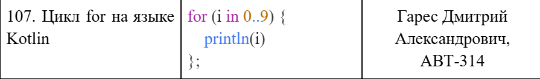  

Диаграмма состояний  
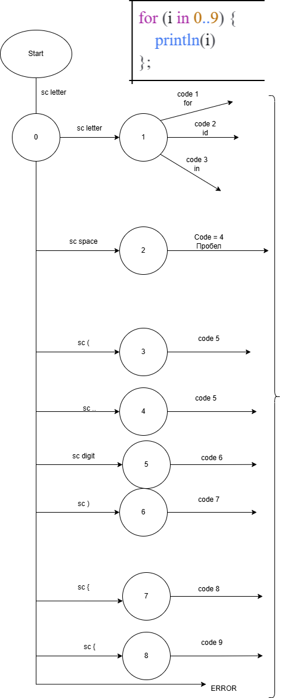 

Текстовые примеры

1. Корректный пример
val x = 123;
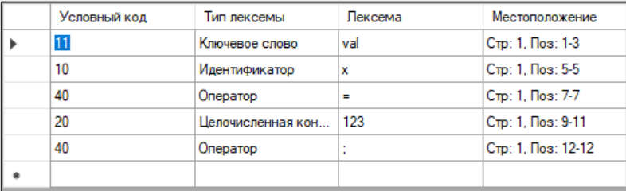  

2. Строка с недопустимым символом val x = 10 @
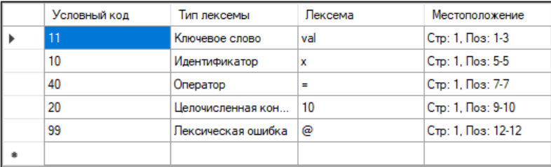  

3. Многострочный пример  
fun main() {  
    val a = 5  
    val b = 10  
}
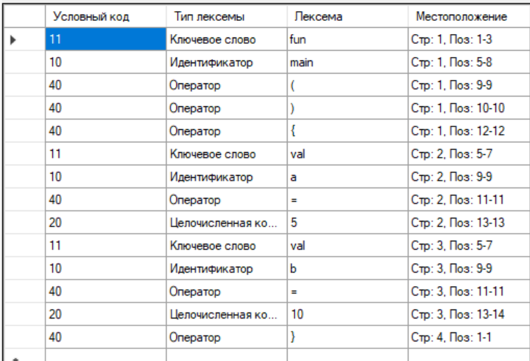  

# Лабораторная работа 3. Разработка синтаксического анализатора (парсера)

Цель: Изучить назначение и принципы работы синтаксического анализатора в структуре компилятора. Спроектировать грамматику, построить соответствующую схему метода анализа грамматики и выполнить программную реализацию парсера с нейтрализацией синтаксических ошибок методом Айронса. Интегрировать разработанный модуль в ранее созданный графический интерфейс языкового процессора. 

Выполнил:  Гарес Д. А. Группа: АВТ-314 Факультет: АВТФ НГТУ

Разработать синтаксический анализатор (парсер) в соответствии с индивидуальным вариантом курсовой (расчетно-графической) работы, интегрировать его в приложение из лабораторной работы №1 и обеспечить наглядный вывод результатов анализа. 

Требования к разработке парсера:
- Разработать грамматику для заданной синтаксической конструкции.
- Построить схему метода анализа на основе разработанной грамматики.
- Выполнить программную реализацию алгоритма работы синтаксического анализа.
- Реализовать алгоритм нейтрализации синтаксических ошибок методом Айронса.
- Входные данные — строка (текст программного кода) из области редактирования.
- Выходные данные: При успешном анализе корректной строки — сообщение об отсутствии ошибок. При обнаружении ошибок — таблица с описанием каждой ошибки.

Требования к интеграции и интерфейсу:
- Встроить парсер в ранее разработанный интерфейс (ЛР1) и связать его с кнопкой «Пуск» (или отдельной кнопкой для синтаксического анализа).
- Окно вывода результатов должно содержать таблицу ошибок со следующими столбцами:
- Неверный фрагмент (символ или фрагмент, вызвавший ошибку).
- Местоположение (номер строки, позиция символа).
- Описание ошибки (опционально).
- В окне вывода также отображается общее количество найденных ошибок.
- Реализовать навигацию по ошибкам: при щелчке на строке таблицы курсор в области редактирования должен устанавливаться на позицию ошибочного фрагмента.

Вариант: выполнить программную реализацию алгоритма синтаксического анализа цикла for на языке Kotlin.

В связи с разработанной контекстно свободной грамматикой G[Z] синтаксический анализатор (парсер)  будет считать верными следующие записи:
for (i in 0..9){
    println(i)
};

## Грамматика:
1)	\<CYCLE\>  -> 'for' \<BRACKET\> 
2)	\<BRACKET\> ->  '(' \<BeginVariable\>
3)	\<BeginVariable\> -> letter \<Variable\> | '_' \<Variable\>
4)	\<Variable\> -> letter \<Variable\> | '_' \<Variable\> | digit \<Variable\> | ' ' \<SPACE\>
5)	\<SPACE\> -> ' '  \<RANGE\>
6)	\<RANGE\> -> 'in' \<SPACE\>
7)	\<SPACE\> -> ' ' \<NUMBER\>
8)	\<NUMBER\> -> digit \<NUM_RANGE\>
9)	\<NUM_RANGE\> -> '..' \<NUMBER\>
10)	\<NUMBER\> -> digit \<BRACKET\>
11)	\<BRACKET\> -> ) \<CUR_BRACKET\>
12)	\<CUR_BRACKET\> -> '{' \<FUNC\>
13)	\<FUNC\> -> 'println' \<BRACKET\>
14)	\<BRACKET\> -> '(' \<BeginVariable\>
15)	 \<BeginVariable\> -> letter \<Variable\> | '_' \<Variable\>
16)	 \<Variable\> -> letter \<Variable\> | '_' \<Variable\> | digit \<Variable\> | ')' \<BRACKET\>
17)	 \<BRACKET\> -> ')' \<CUR_BRACKET\>
18)	 \<CUR_BRACKET\> -> '}' \<END\>
19)	\<END\> -> ';' 

‒ VT = {a, b, ..., z, A, B, ..., Z, 0, 1, ...,9, +, -, /, *, {, }, (, ), ;, _}  
‒ VN = {\<CYCLE\>, \<BRACKET\>, \<NameVar\>, \<SPACE\>, \<RANGE\>, \<NUMBER\>,  \<NUM_RANGE\>, \<CUR_BRACKET\>, \<FUNC\>, \<END\> }.  
‒ letter -> 'a' | 'b' | ... | 'z' | 'A' | 'B' | ... | 'Z'  
‒ digit -> '0' | '1' | ... | '9'  

Согласно классификации Хомского, грамматика G[Z] является контекстно свободной. Правила относятся к классу праворекурсивных автоматных продукций (A → aB | a | ε).

Метод анализа:  
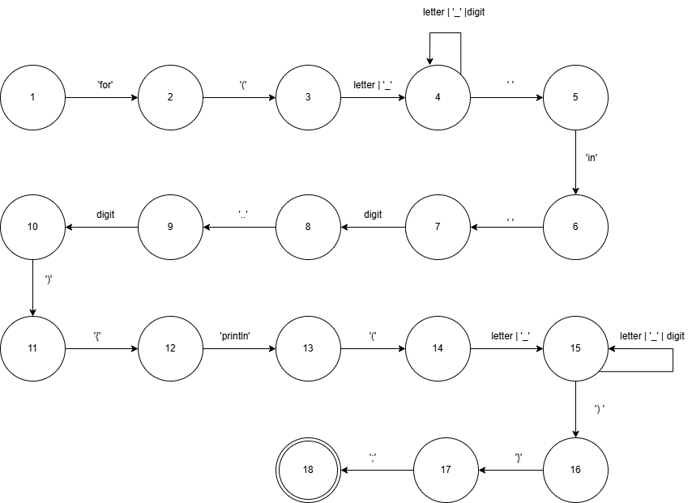

## Диагностика и нейтрализация синтаксических ошибок:

Согласно заданию на курсовую работу, необходимо реализовать нейтрализацию синтаксических ошибок, используя метод Айронса:

При обнаружении ошибки (во входной цепочке в процессе разбора встречается символ, который не соответствует ни одному из ожидаемых символов), входная цепочка символов выглядит следующим образом: Tt, где T – следующий символ во входном потоке (ошибочный символ), t – оставшаяся во входном потоке цепочка символов после T. Алгоритм нейтрализации состоит из следующих шагов:
1. Определяются недостроенные кусты дерева разбора;
2. Формируется множество L – множество остаточных символов недостроенных кустов дерева разбора;
3. Из входной цепочки удаляется следующий символ до тех пор, пока цепочка не примет вид Tt, такой, что U => T, где U ∈ L, то есть до тех пор, пока следующий в цепочке символ T не сможет быть выведен из какого-нибудь из остаточных символов недостроенных кустов.
4. Определяется, какой из недостроенных кустов стал причиной появления символа U в множестве L (иначе говоря, частью какого из недостроенных кустов является символ U).
Таким образом, определяется, к какому кусту в дереве разбора можно «привязать» оставшуюся входную цепочку символов после удаления из текста ошибочного фрагмента.\

Для автоматной грамматики предлагается свести алгоритм нейтрализации к последовательному удалению следующего символа во входной цепочке до тех пор, пока следующий символ не окажется одним из допустимых в данный момент разбора.

## Тестовые примеры:

# Лабораторная работа 4. Реализация алгоритма поиска подстрок с помощью регулярных выражений

Цель: Изучить теоретические основы регулярных выражений и их применение для поиска и извлечения подстрок из текста. Освоить практические навыки использования библиотечных средств работы с регулярными выражениями, а также интеграцию алгоритмов поиска в графический интерфейс приложения.

Выполнил: Гарес Д. А. Группа: АВТ-314 Факультет: АВТФ НГТУ

Постановка задачи: Разработать модуль поиска подстрок с использованием регулярных выражений, интегрировать его в существующее приложение (текстовый редактор) и обеспечить наглядный вывод результатов.

Требования к программе:
- Интегрировать модуль поиска в существующий интерфейс текстового редактора (ЛР1).
- Добавить в интерфейс элементы управления для выбора типа поиска (выпадающий список или кнопки) и запуска анализа.
- Результаты поиска должны отображаться в таблице с колонками: Найденная подстрока (извлеченный фрагмент) / Начальная позиция (номер строки, номер символа) / Длина (количество символов).
- При выборе строки в таблице результатов соответствующая подстрока в области редактирования должна подсвечиваться (изменение цвета фона или выделение).
- Возможность вывода количества найденных совпадений.

Входные и выходные данные:
- Вход: текст, введенный пользователем в область редактирования.
- Выход: таблица найденных подстрок с указанием позиций, длины и количества совпадений; подсветка соответствующих фрагментов в исходном тексте.

## Вариант:
1) Построить РВ для поиска цитат (предложений, заключенных в одинарные кавычки).
2) Построить РВ для поиска идентификатора, который может начинаться только с буквы a-zA-Z, знака доллара $ или подчеркивания _, оставшаяся часть символов идентификатора представляют собой только буквы a-zA-Z или цифры.
3) Построить РВ, описывающее российские автомобильные номера.
## Решение задач:
### Построить РВ для поиска цитат (предложений, заключенных в одинарные кавычки).
Регулярное выражение: /\'[^\']*\'/, где ' — совпадение с одинарной кавычкой; [^'] — совпадение с любым символом, кроме одинарной кавычки; * — совпадение с предыдущим токеном [^'] 0 или больше раз; завершающая ' — закрывающая одинарная кавычка.

Примеры строк, которые должны находиться: 'hello', 'bar', '', 'see you'

Примеры строк, которые не должны находиться: hello, "bar", 'can’t', 'abc

Тестовые примеры (скриншоты):
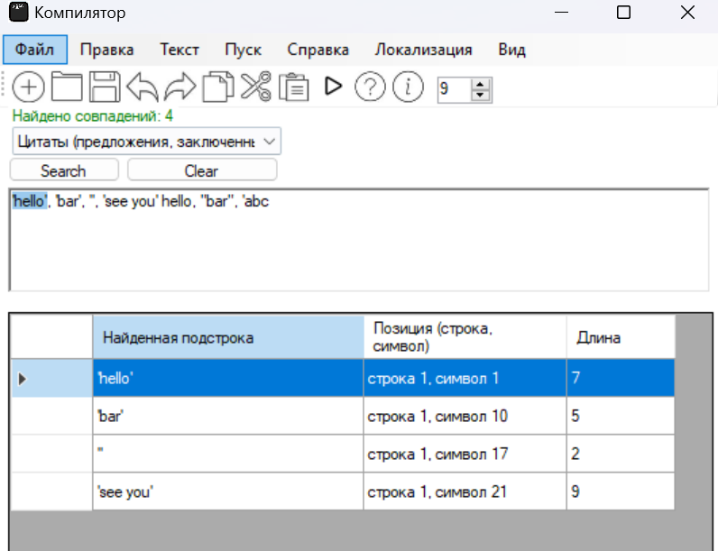

### Построить РВ для поиска идентификатора, который может начинаться только с буквы a-zA-Z, знака доллара $ или подчеркивания _, оставшаяся часть символов идентификатора представляют собой только буквы a-zA-Z или цифры.
Регулярное выражение: ^[a-z|A-Z|$|_][a-z|A-Z|0-9]*$, где ^ — начало строки; [a-z|A-Z|$|_] — первый символ должен быть латинской буквой в нижнем или верхнем регистре, символом $ или _; [a-z|A-Z|0-9]* — далее могут идти латинские буквы или цифры 0 и более раз; $ — конец строки.

Примеры строк, которые должны находиться: hello, _value1, $test, Var123

Примеры строк, которые не должны находиться: 1hello, @name, -test, abc!

Тестовые примеры (скриншоты):
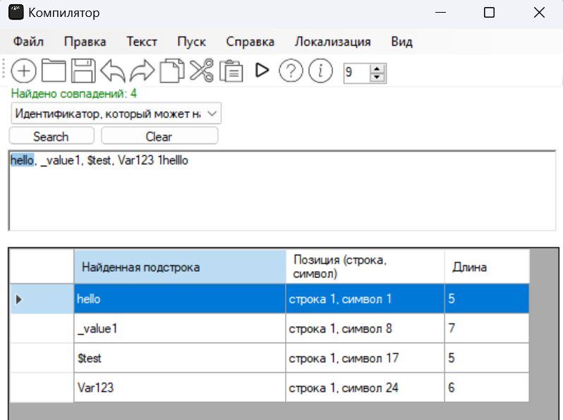

### Построить РВ, описывающее российские автомобильные номера.
Регулярное выражение: /^([АВЕКМНОРСТУХ])(\d{3})([АВЕКМНОРСТУХ]{2})(\d{2,3})$/, где ^ — начало строки; ([АВЕКМНОРСТУХ]) — одна буква из набора разрешённых кириллических символов; (\d{3}) — ровно 3 цифры; ([АВЕКМНОРСТУХ]{2}) — ещё 2 буквы из того же набора; (\d{2,3}) — 2 или 3 цифры; $ — конец строки.

Регулярное выражение используется для проверки автомобильных номеров российского формата.

Примеры строк, которые должны находиться: А123ВС77, М456ОР199, Т001КХ50

Примеры строк, которые не должны находиться: A123BC77, 123АВС77, А12ВС777, А123ВС7777

Тестовые примеры (скриншоты):
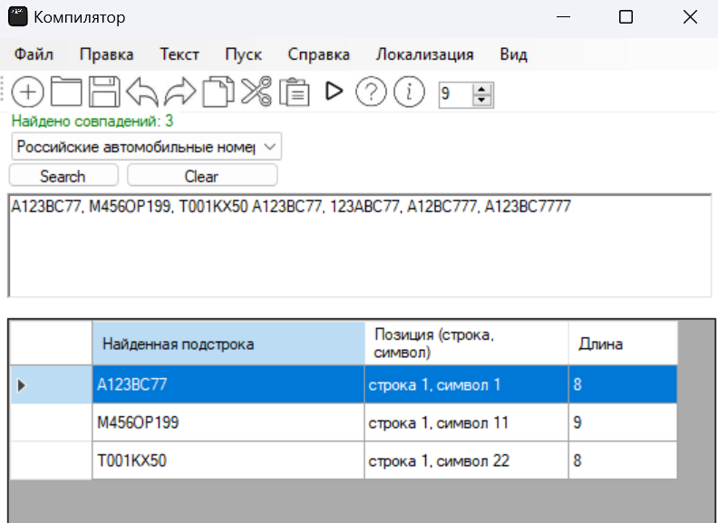

# Лабораторная работа 5. Построение AST и проверка контекстно-зависимых условий

Выполнил: Гарес Д. А. Группа: АВТ-314 Факультет: АВТФ НГТУ

## Вариант:

Цикл for на языке Kotlin (Например, "for( i in 0..9){println(i)};")

## Контекстно-зависимые условия:

Учитывая вариант задания, программа проверяет следующие контекстно-зависимые условия:

- Уникальность имён: Проверить, что имя не было объявлено ранее в той же области видимости.

- Допустимые значения: Проверить, что значение находится в допустимых пределах (для числовых типов).

На данный момент условия совместимости типов и использования идентификаторов не проходят проверку синтактического анализа.

## Структура AST:

- ProgramNode (корневой узел). Атрибуты: Количество операторов в программе, Список операторов,
- ForLoopNode (цикл for). Атрибуты: Переменная цикла (IdentifierNode), Ключевое слово "in", Итерируемое выражение (RangeExpressionNode), Тело цикла (BlockNode),
- IdentifierNode (идентификатор). Атрибуты: Имя переменной (i),
- RangeExpressionNode (диапазон 0..9). Атрибуты: Начальное значение (IntLiteralNode), Оператор диапазона (".."), Конечное значение (IntLiteralNode),
- IntLiteralNode (целочисленное значение). Атрибуты: Значение (0 или 9),
- BlockNode (блок кода { ... }). Атрибуты: Количество операторов в блоке, Список операторов,
- FunctionCallNode (вызов функции). Атрибуты: Имя функции (println), Список аргументов,
- ArgumentNode (аргумент функции). Атрибуты: Значение аргумента (IdentifierNode с именем i).

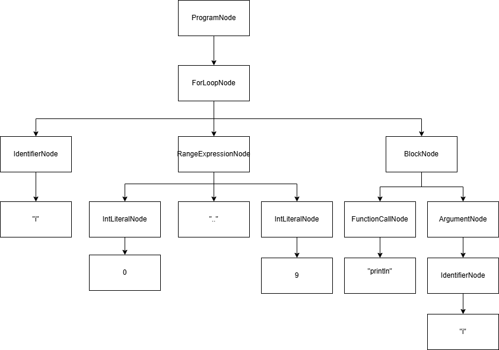

В программе используется формат вывода AST, похожий на tree в командной строке (с отступами и символами ├── и └──).

## Тестовые примеры:

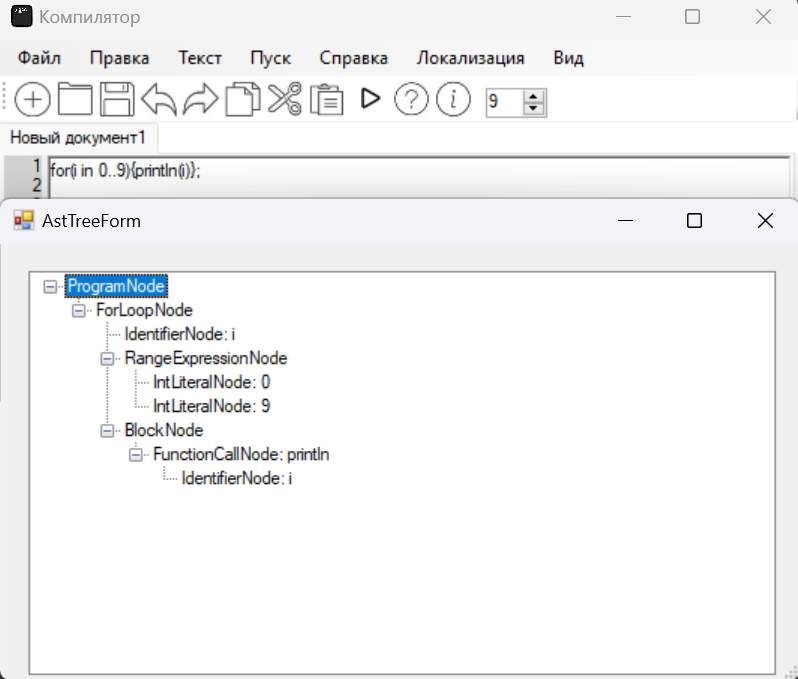
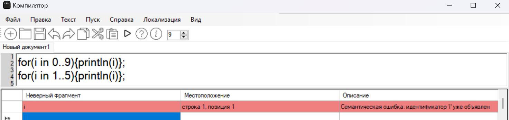
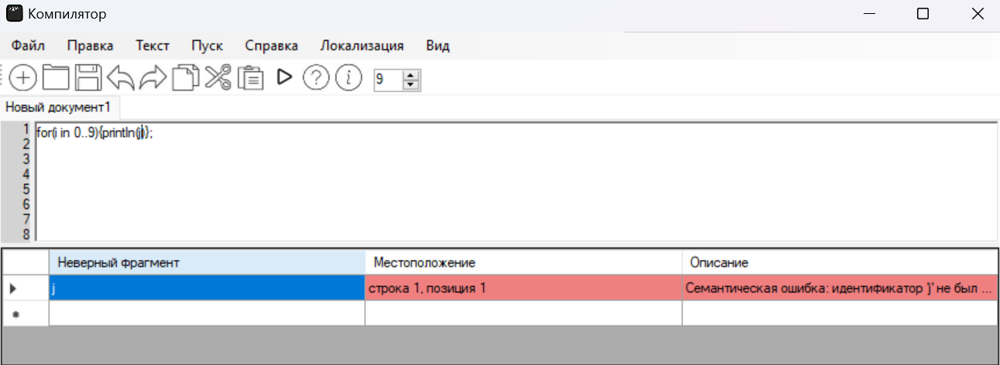

## Инструкция по запуску
- Запустить exe.
- Создать файл или открыть файл txt.
- Запустить файл по нажатию «Пуск».

# Лабораторная работа 7. Анализ и преобразование кода с использованием Clang и LLVM

Выполнил: Гарес Д. А. Группа: АВТ-314 Факультет: АВТФ НГТУ

## Постановка задачи
Познакомиться с инструментами Clang и LLVM, научиться собирать AST и IR-промежуточное представление кода на C/C++, а также извлекать базовую информацию о программе (например, список функций).

Индивидуальная часть работы:  Цикл for

Задания:
1. Получите IR для -O0.
2. Примените -O2 и найдите, исчезла ли переменная LIMIT.
3. Примените отдельно -constprop и -ipsccp.
4. Постройте CFG до и после оптимизаций.
5. Сделайте вывод о том, как и когда константа подставляется?

## Общее задание

### Работа с AST
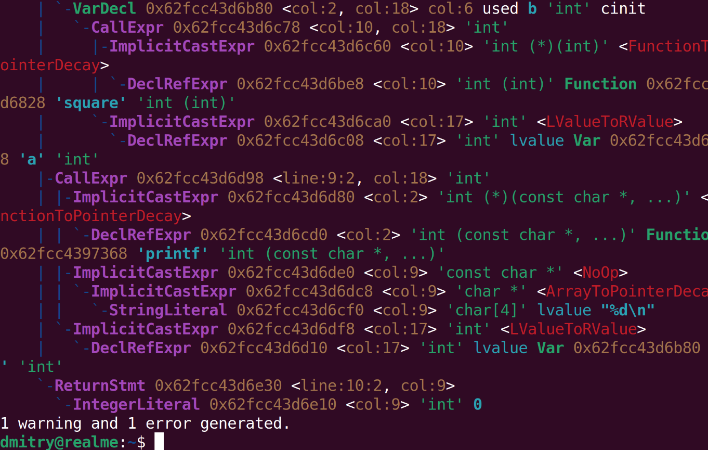

### Генерация LLVM IR
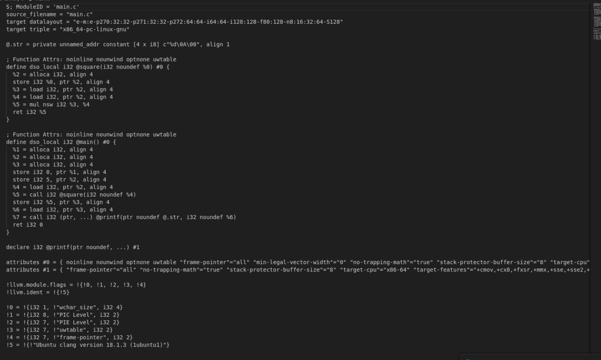

### Оптимизация IR
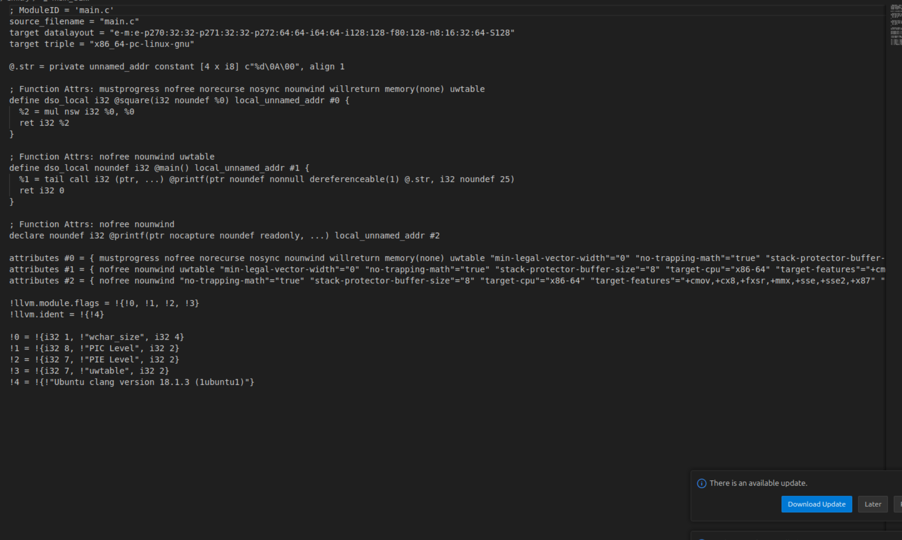
### Построение CFG
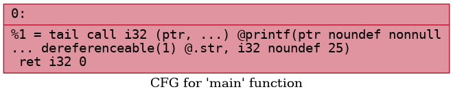
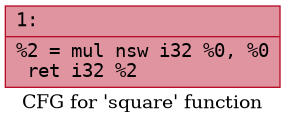

## Индивидуальное задание

### Цикл for
Пример кода:
int main() {
int sum = 0;
for (int i = 0; i < 10; i++) {
sum += i;
}
return sum;
}
Задания:
1. Получите IR для -O0.
   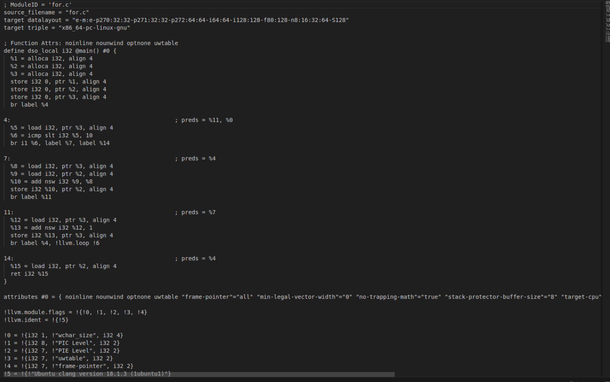
2. Получите IR для -O2. Раскрыт ли цикл?  
   Да, цикл раскрыт. Это возможно потому известно конечное значение цикла
   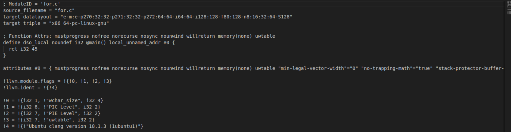
3. Примените -unroll-count=4 и сравните.
    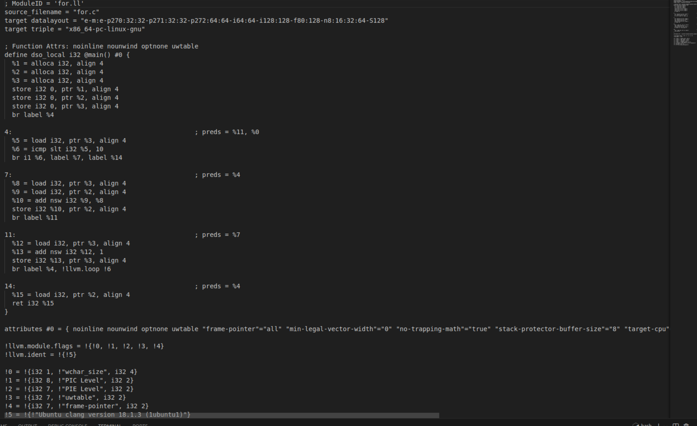
4. Постройте CFG.  
   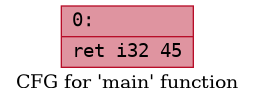
5. Сделайте вывод об оптимизации циклов в LLVM.
В ходе экспериментального анализа установлено, что LLVM выполняет агрессивную оптимизацию циклов с известными границами. При компиляции с флагом -O2 цикл суммирования от 0 до 9 был полностью свёрнут в константу: 30 строк LLVM IR сократились до единственной инструкции ret i32 45. Это достигнуто за счёт последовательного применения пассов: mem2reg (преобразование в SSA-форму), indvars (упрощение индукционных переменных), loop-unroll (размотка цикла), instcombine (распространение констант) и die (удаление мёртвого кода). Ключевую роль играют атрибуты функций (mustprogress, memory(none) и др.), которые дают оптимизатору дополнительные гарантии безопасности преобразований. 

## Выводы
● С помощью Clang можно получить полную структуру AST и
IR, а также CGF;  
● LLVM предоставляет гибкие инструменты анализа и
оптимизации;  
● Промежуточное представление кода удобно для написания
компиляторных трансформаций.  
