# Лабораторная работа 1. Разработка пользовательского интерфейса (GUI) для языкового процессора

Цель: Создание кроссплатформенного графического интерфейса (GUI) для языкового процессора в виде специализированного текстового редактора.

Выполнил: Гарес Д. А.
Группа: АВТ-314
Факультет: АВТФ НГТУ

Описание проекта: Текстовый редактор, закладывающий основу для разработки языкового процессора. В текущей реализации — простой редактор с базовым функционалом, в перспективе — инструмент для лексического, синтаксического и семантического анализа кода.

Используемые технологии: C#, Windows Forms, Visual Studio 2022

## Инструкция по сборке и запуску:
- Выбрать Compiler Executable во вкладке Releases
- Скачать файл compiler.exe
- Программа готова к запуску

## Руководство пользователя:
На рисунке приведен пример рабочего окна текстового редактора.
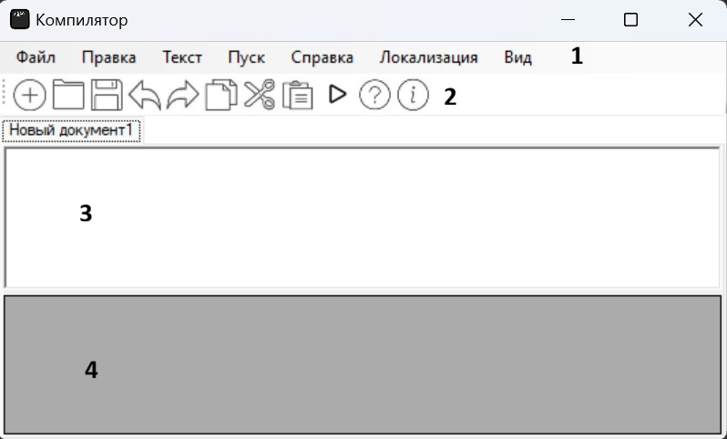

1 – основное меню программы;
2 – панель инструментов;
3 – окно/область ввода/редактирования текста;
4 – окно/область отображения результатов работы языкового процессора.

Панель инструментов содержит кнопки вызова часто используемых пунктов меню:
1) Создание документа
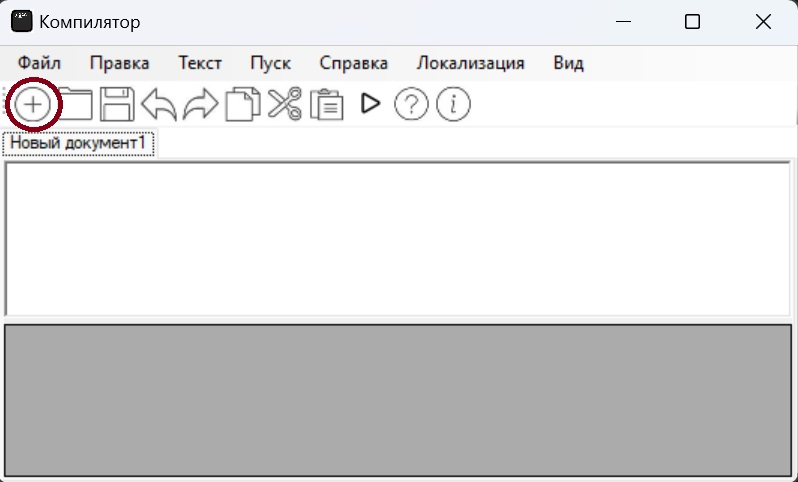

2) Открытие документа
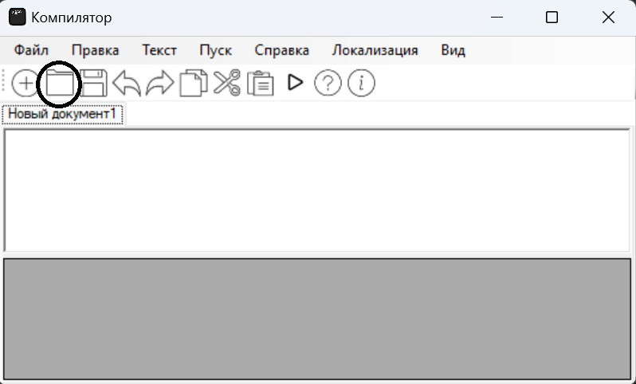

3) Сохранение текущих изменений в документе
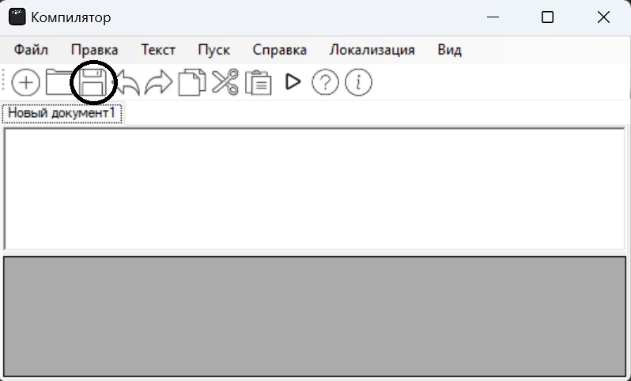

4) Отмена изменений
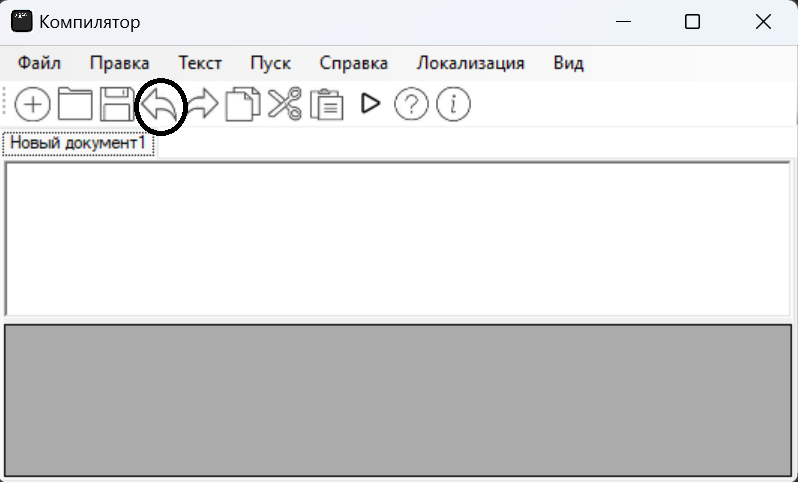

5) Повтор последнего изменения
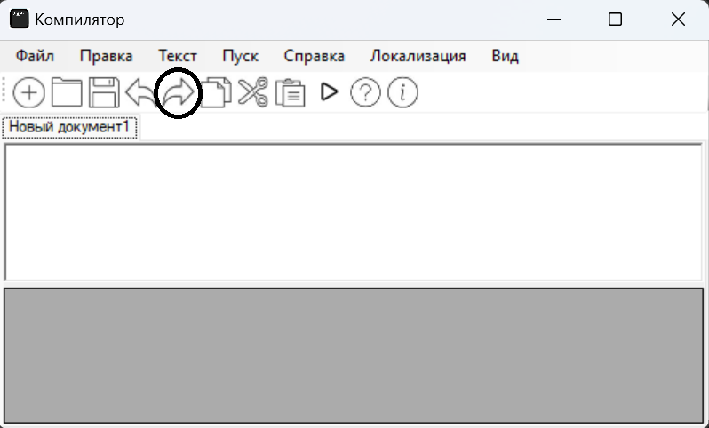

6) Вырезать текстовый фрагмент
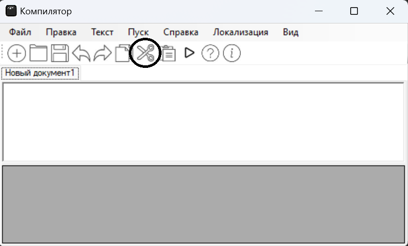

7) Копировать текстовый фрагмент
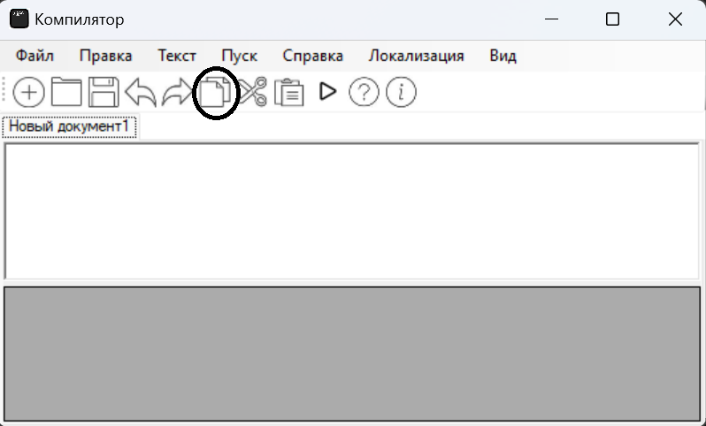

8) Вставить текстовый фрагмент
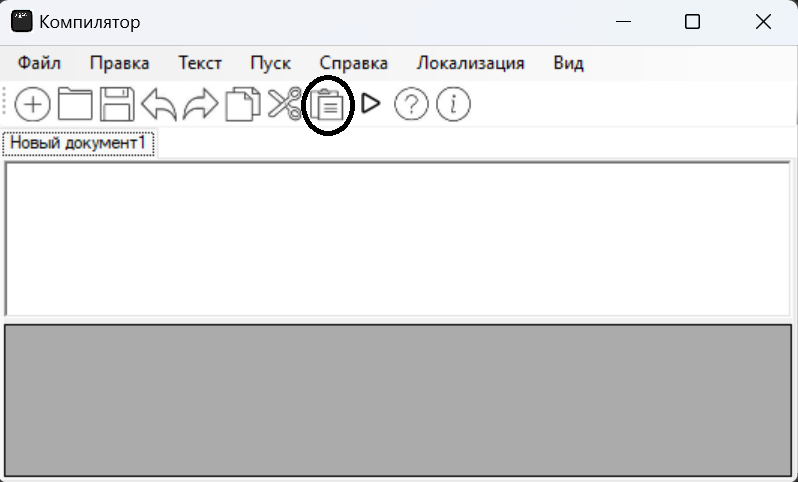

10) Вызов справки - руководства пользователя
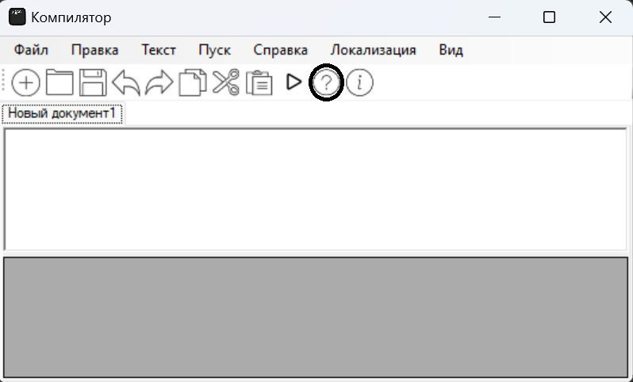

11) Вызов информации о программе
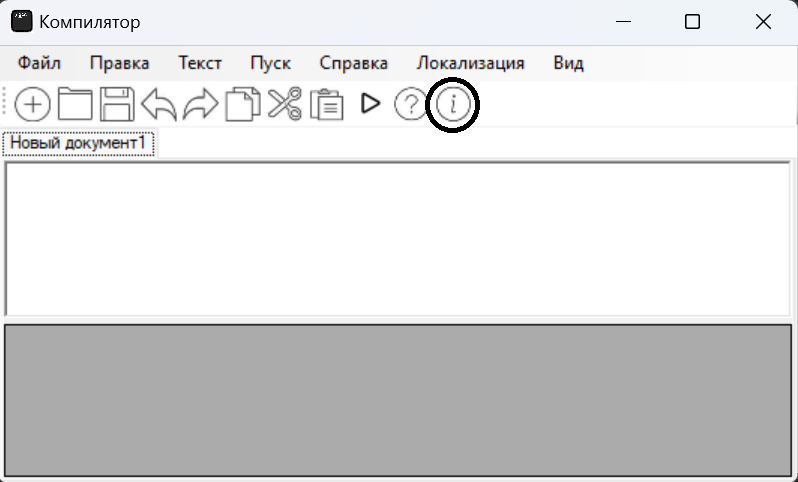

Главное меню программы имеет дополнительные функции:
12) Выход
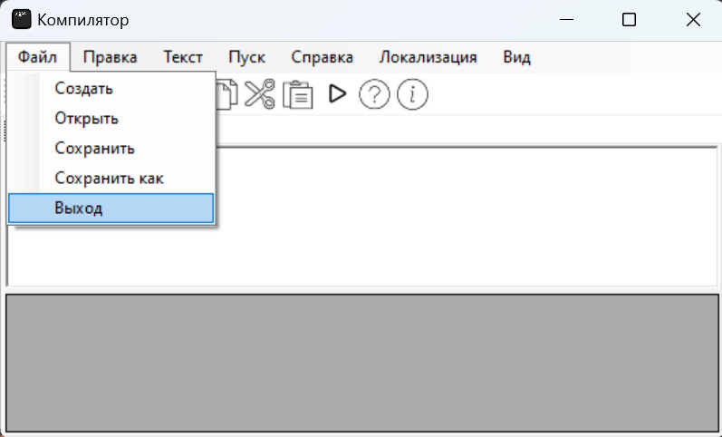

13) Удалить
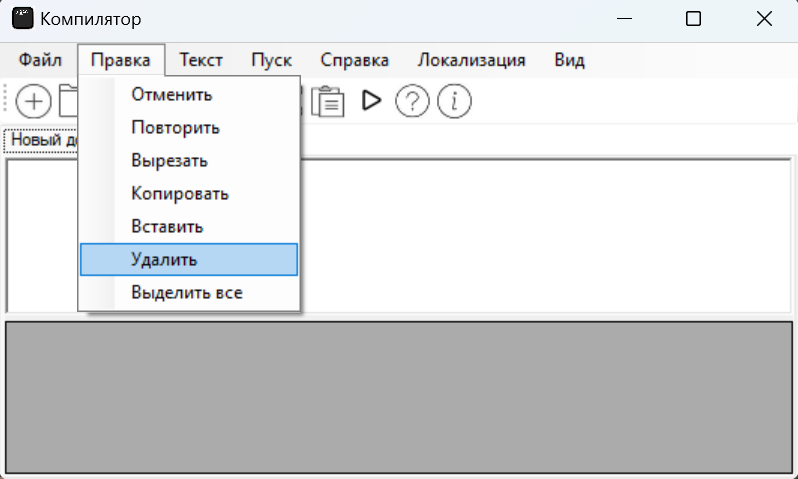

14) Выделить все
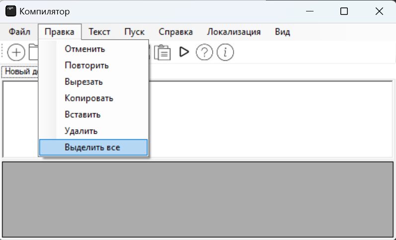

## Ограничения:
Данная версия программы иммеет ограниченный функционал. Не работают функции меню Пуск, Текст, Локализация, Вид
